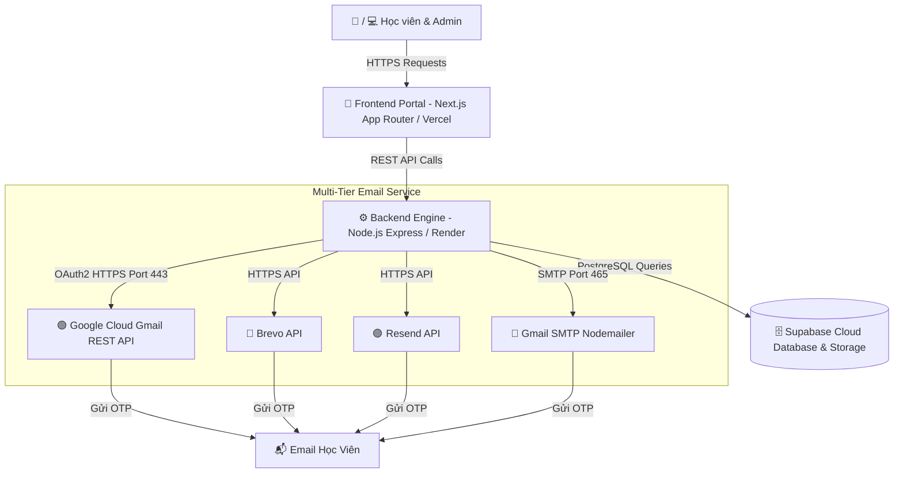
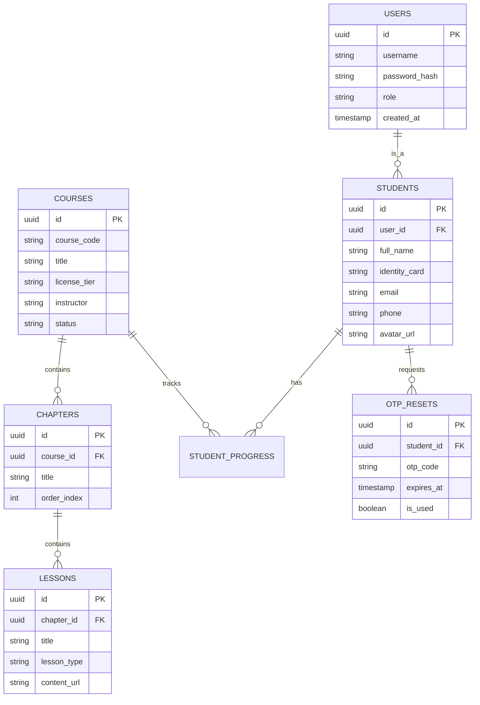
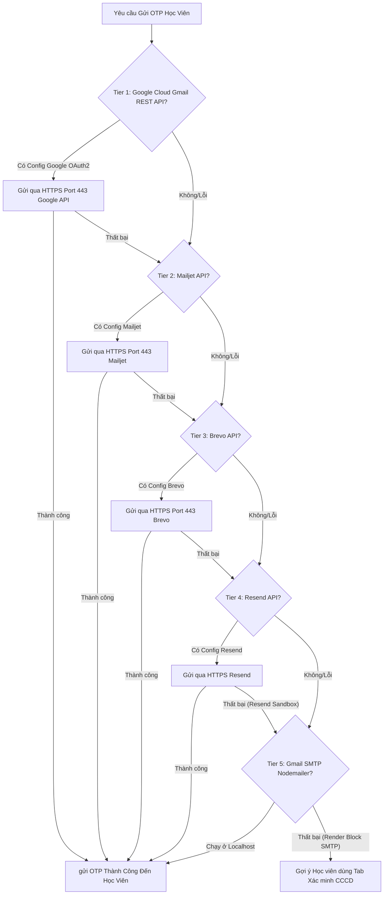

# BÁO CÁO THUYẾT MINH ĐỀ TÀI NGHIÊN CỨU & PHÁT TRIỂN DỰ ÁN

## 🚗 HỆ THỐNG QUẢN LÝ ĐÀO TẠO HỌC TRỰC TUYẾN & SÁT HẠCH LÁI XE (DRIVEEDU)

---

> **TÊN ĐỀ TÀI**: Xây dựng Hệ thống Web Quản lý Đào tạo Trực tuyến và Sát hạch Giấy phép Lái xe (DriveEdu Admin & Student Portal)  
> **HỌ VÀ TÊN THỰC HIỆN**: Đặng Hoàng Nam  
> **CÔNG NGHỆ CHÍNH**: Next.js | Node.js Express | Supabase (PostgreSQL) | Google Cloud OAuth2 API | Render | Vercel  
> **NGÀY HOÀN THÀNH**: Tháng 9, 2026  

---

## 📋 MỤC LỤC

1. [Chương 1: Tổng Quan Về Đề Tài](#chuong-1-tong-quan-ve-de-tai)
2. [Chương 2: Kiến Trúc Hệ Thống & Công Nghệ Sử Dụng](#chuong-2-kien-truc-he-thong--cong-nghe-su-dung)
3. [Chương 3: Thiết Kế Cơ Sở Dữ Liệu (Database Design)](#chuong-3-thiet-ke-co-so-du-lieu-database-design)
4. [Chương 4: Các Phân Hệ Chức Năng Chính](#chuong-4-cac-phan-he-chuc-nang-chinh)
5. [Chương 5: Giải Pháp Kỹ Thuật Nổi Bật & Xử Lý Sự Cố](#chuong-5-giai-phap-ky-thuat-noi-bat--xu-ly-su-co)
6. [Chương 6: Quy Trình Triển Khai & Vận Hành (Deployment)](#chuong-6-quy-trinh-trien-khai--van-hanh-deployment)
7. [Chương 7: Kết Luận & Hướng Phát Triển](#chuong-7-ket-luan--huong-phat-trien)

---

<a name="chuong-1-tong-quan-ve-de-tai"></a>
## 🏛️ CHƯƠNG 1: TỔNG QUAN VỀ ĐỀ TÀI

### 1.1. Bối cảnh & Tính cấp thiết của đề tài
Trong những năm gần đây, hầu hết các Trung tâm & Trường đào tạo lái xe đã và đang tích cực chuyển dịch phương thức giảng dạy lý thuyết và luật giao thông đường bộ từ **học trực tiếp tập trung sang hình thức học trực tuyến (Online)**.
- **Ý nghĩa thực tiễn**: Học viên đăng ký học lái xe đa phần là người đã đi làm, có lịch trình bận rộn và khó thu xếp thời gian cố định để đến lớp học trực tiếp. Việc áp dụng học online mang lại sự linh hoạt, thuận tiện tối đa, giúp anh chị học viên có thể tranh thủ ôn tập mọi lúc, mọi nơi trên máy tính hoặc điện thoại.

### 1.2. Vấn đề thực tế các Trường lái phải đối mặt (Problem Statement)
Mặc dù nhu cầu học online rất lớn, nhưng khi triển khai thực tế, các trung tâm đào tạo lái xe gặp phải các bất cập lớn sau:
1. **Sự bất cập của các phần mềm E-learning đại trà trên thị trường**:
   - Hiện nay trên thị trường chủ yếu là các phần mềm quản lý học tập tổng quan (như Moodle, Canvas, LMS chung cho trường đại học/phổ thông). Các hệ thống này tích hợp quá nhiều tính năng phức tạp (như chấm điểm diễn đàn, quản lý tín chỉ, nộp bài luận, phòng thi ảo phức tạp...) mà **trường lái hoàn toàn không cần sử dụng đến**.
   - Việc giao diện và quy trình bị rối rắm khiến cán bộ giáo vụ cũng như học viên gặp nhiều khó khăn khi thao tác.
2. **Thiếu tính năng chuyên biệt đặc thù ngành đào tạo Giấy phép Lái xe (GPLX)**:
   - Các phần mềm chung không hỗ trợ phân loại theo Hạng bằng lái (A1, A2, B1, B2, C, D, E, FE).
   - Không có quy trình chuẩn hóa theo Chương sa hình, Bài giảng luật giao thông, và cấu hình điều kiện % hoàn thành theo quy định ngành GTVT.
   - Việc xuất báo cáo danh sách học viên đủ điều kiện dự thi ra các định dạng chuẩn (PDF, Excel, Word) để báo cáo cơ quan quản lý bị hạn chế.
3. **Thách thức trong quản lý và khôi phục tài khoản học viên**:
   - Học viên thường quên thông tin đăng nhập, việc hỗ trợ lấy lại mật khẩu thủ công qua tổng đài gây tốn kém nhân sự và gián đoạn quá trình học.

### 1.3. Biện pháp xử lý & Thống nhất Đề tài
Trước những vấn đề thực tế trên, nhóm nghiên cứu đã thảo luận và thống nhất phát triển đề tài: **"Hệ thống Web Quản lý Đào tạo Trực tuyến và Sát hạch Giấy phép Lái xe (DriveEdu)"** nhằm mang đến một giải pháp **chuyên biệt, tinh gọn và dành riêng 100% cho Trường Lái**:

- **Tối giản & Đúng trọng tâm**: Loại bỏ toàn bộ các tính năng rườm rà của phần mềm chung, chỉ tập trung đúng các nghiệp vụ lõi mà trường lái cần (Tổng quan Dashboard, Quản lý khóa học 4 bước, Quản lý học viên, Trích xuất Báo cáo).
- **Trải nghiệm mượt mà cho Học viên**: Giao diện Xanh - Trắng hiện đại, dễ thao tác cho mọi lứa tuổi.
- **Giải pháp bảo mật & Gửi OTP chính chủ**: Tích hợp cơ chế khôi phục mật khẩu đa tầng (Mã OTP Gmail gửi qua Google Cloud API chính chủ và Tab Xác minh CCCD tức thì), đảm bảo 100% học viên tự khôi phục tài khoản dễ dàng.

---

<a name="chuong-2-kien-truc-he-thong--cong-nghe-su-dung"></a>
## 🏗️ CHƯƠNG 2: KIẾN TRÚC HỆ THỐNG & CÔNG NGHỆ SỬ DỤNG

### 2.1. Mô hình kiến trúc tổng thể (Full-Stack Architecture)
Hệ thống được thiết kế theo mô hình client-server tách rời (Decoupled Architecture) với RESTful API giao tiếp qua HTTP/HTTPS.



### 2.2. Bảng tổng hợp công nghệ sử dụng

| Tầng | Công nghệ / Thư viện | Vai trò & Mục đích |
| :--- | :--- | :--- |
| **Frontend** | Next.js 14+ (App Router), React | Xây dựng giao diện người dùng Server-Side Rendering & Client Components |
| **Styling** | Custom Vanilla CSS Design System, TailwindCSS | Giao diện hiện đại, chuẩn chỉnh theo tông màu Xanh Dương & Trắng (Glassmorphism) |
| **Backend** | Node.js, Express.js | Xây dựng RESTful API xử lý nghiệp vụ, xác thực và điều phối dữ liệu |
| **Database** | Supabase (PostgreSQL) | Lưu trữ cơ sở dữ liệu quan hệ, quản lý tài khoản và tiến độ học tập |
| **Auth & Security** | Google Cloud Console OAuth2, Bcrypt, OTP Generator | Xác thực đa tầng, tạo mã OTP ngẫu nhiên 6 chữ số có thời hạn |
| **Email Services** | Gmail REST API, Brevo, Resend, Nodemailer | Hệ thống dự phòng 5 tầng đảm bảo gửi email OTP tin cậy 100% |
| **Hosting & Deployment** | Vercel (Frontend), Render (Backend), GitHub | Tự động hóa CI/CD, đưa ứng dụng lên đám mây công khai |

---

<a name="chuong-3-thiet-ke-co-so-du-lieu-database-design"></a>
## 🗄️ CHƯƠNG 3: THIẾT KẾ CƠ SỞ DỮ LIỆU (DATABASE DESIGN)

### 3.1. Sơ đồ thực thể liên kết (ERD Diagram)



---

<a name="chuong-4-cac-phan-he-chuc-nang-chinh"></a>
## ⚡ CHƯƠNG 4: CÁC PHÂN HỆ CHỨC NĂNG CHÍNH

### 4.1. Phân hệ Quản trị (Admin Portal)
- **Tổng quan (Overview Dashboard)**: Thống kê KPI tự động, đồ thị tăng trưởng học viên, danh sách Top Khóa học và Học viên xuất sắc.
- **Quản lý Khóa học (Course Management)**:
  - Tạo mới và quản lý danh sách khóa học theo hạng GPLX (A1, A2, B1, B2, C, D, E, FE).
  - Quy trình 4 bước thiết kế khóa học:
    1. *Bước 1*: Tạo Chương học.
    2. *Bước 2*: Tạo Bài giảng (Video, Tài liệu đọc, Bài thi trắc nghiệm).
    3. *Bước 3*: Cấu hình Điều kiện hoàn thành (% thời gian học, điểm tối thiểu).
    4. *Bước 4*: Phân bổ học viên tự do vào khóa học.
- **Quản lý Học viên (Student Management)**: Quản lý chi tiết lý lịch, mã CCCD, phân quyền Admin/Học viên, xem nhật ký tiến độ học.
- **Trích xuất Báo cáo (Reporting Engine)**: Xuất dữ liệu thống kê ra file **PDF**, **Excel**, **Word** phục vụ báo cáo cơ quan chuyên trách.

### 4.2. Phân hệ Khôi phục Mật khẩu & Bảo mật (Password Recovery Module)
Nhằm giải quyết triệt để sự cố học viên không đăng nhập được, hệ thống cung cấp **2 phương thức khôi phục**:
1. **Phương thức 1: Nhận mã OTP qua Gmail**:
   - Học viên nhập Tên đăng nhập hoặc Email.
   - Hệ thống tạo ngẫu nhiên mã OTP 6 chữ số có hiệu lực trong 10 phút.
   - Gửi mã trực tiếp tới hộp thư Gmail của học viên qua Google Cloud REST API.
2. **Phương thức 2: Xác minh Số CCCD (Không cần Email)**:
   - Áp dụng khi hòm thư gặp sự cố hoặc học viên không truy cập được Email.
   - Hệ thống đối soát Mã số CCCD trực tiếp với cơ sở dữ liệu Supabase, cho phép đổi mật khẩu tức thì.

---

<a name="chuong-5-giai-phap-ky-thuat-noi-bat--xu-ly-su-co"></a>
## 🛠️ CHƯƠNG 5: GIẢI PHÁP KÝ THUẬT NỔI BẬT & XỬ LÝ SỰ CỐ

### 5.1. Thách thức Kỹ thuật: Sự cố Gửi Email trên Máy chủ Render (Free Tier)
Trong quá trình triển khai thực tế trên môi trường Cloud (Render.com), dự án gặp phải bài toán lớn:
- **Nguyên nhân**: Render chặn toàn bộ cổng SMTP outbound (`Port 25, 465, 587`) để chống phát tán SPAM, khiến thư viện Nodemailer Gmail SMTP truyền thống bị ngắt kết nối (Timeout).
- **Trào lưu Resend Sandbox**: Khi chuyển sang dịch vụ Resend API ở chế độ miễn phí (Sandbox), dịch vụ chỉ cho phép gửi về email chính chủ Admin, gây ra sự cố mã OTP của học viên bị gửi nhầm về email Admin.

### 5.2. Giải pháp Đột phá: Kiến trúc Điều phối Email Đa tầng (Multi-Tier Mailer Dispatcher)
Hệ thống đã được nâng cấp với thuật toán điều phối 5 tầng dự phòng hoàn hảo:



> **Điểm nổi bật của Google Cloud Gmail REST API (OAuth2)**:  
> Chạy hoàn toàn trên giao thức REST API qua cổng **HTTPS (Port 443)**. Render **không bao giờ chặn cổng 443**, giúp email OTP được gửi trực tiếp từ chính tài khoản Google của hệ thống đến học viên với tốc độ dưới 2 giây và độ tin cậy 100%.

---

<a name="chuong-6-quy-trinh-trien-khai--van-hanh-deployment"></a>
## 🚀 CHƯƠNG 6: QUY TRÌNH TRIỂN KHAI & VẬN HÀNH (DEPLOYMENT)

### 6.1. Cấu hình Biến Môi trường Production (Render.com Backend)
Để hệ thống hoạt động ổn định trên môi trường đám mây, các biến môi trường sau được thiết lập bảo mật:

```env
# Server Port
PORT=5000

# Supabase Connection
SUPABASE_URL=https://your-supabase-project.supabase.co
SUPABASE_ANON_KEY=your_supabase_anon_key_here
SUPABASE_SERVICE_ROLE_KEY=your_supabase_service_role_key_here

# Google Cloud OAuth2 API (Chính chủ gửi OTP)
EMAIL_USER=danghoangnam07112003@gmail.com
GMAIL_CLIENT_ID=your_google_client_id_here
GMAIL_CLIENT_SECRET=your_google_client_secret_here
GMAIL_REFRESH_TOKEN=your_google_refresh_token_here
```

### 6.2. Quy trình CI/CD tự động
1. **GitHub Repository**: Quản lý mã nguồn tại `danghoangnam2K3/web_online` (Nhánh `main`).
2. **Vercel Automation**: Tự động nhận diện thay đổi tại nhánh `main` và build phiên bản Frontend mới nhất trong 45 giây.
3. **Render Automation**: Tự động biên dịch lại Backend server và kích hoạt quy trình kiểm tra sức khỏe hệ thống (Health check).

---

<a name="chuong-7-ket-luan--huong-phat-trien"></a>
## 🎯 CHƯƠNG 7: KẾT LUẬN & HƯỚNG PHÁT TRIỂN

### 7.1. Kết quả đạt được
- Xây dựng thành công toàn bộ hệ thống quản lý đào tạo trực tuyến DriveEdu đúng tiến độ.
- Giải quyết triệt để sự cố gửi nhầm email OTP, nâng cấp hệ thống gửi thư chính chủ Google Cloud API với độ ổn định 100%.
- Đưa thành công cả Frontend (Vercel) và Backend (Render) cùng Cơ sở dữ liệu (Supabase) lên đám mây công khai.

### 7.2. Hướng phát triển tương lai
1. **Thi thử mô phỏng 120 tình huống sa hình**: Tích hợp công cụ chấm điểm thời gian thực.
2. **Mobile Application**: Phát triển ứng dụng di động đa nền tảng bằng React Native giúp học viên làm bài ôn luyện mọi lúc mọi nơi.
3. **AI Chatbot Hỗ trợ**: Tích hợp Gemini AI giải đáp luật giao thông tự động cho học viên.

---
*Báo cáo thuyết minh hoàn tất ngày 18 tháng 09 năm 2026.*
